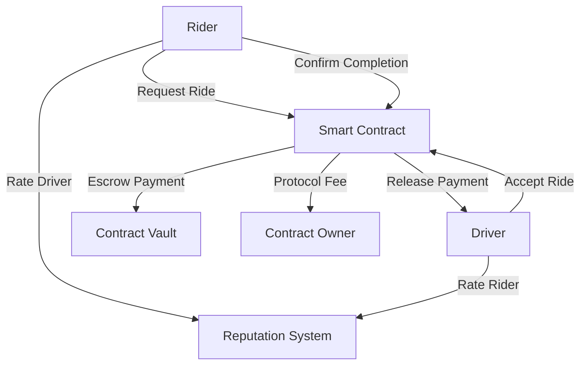

# QuantumRide Ride Sharing Protocol

A decentralized ride-sharing protocol that connects drivers and riders directly on the Stacks blockchain, eliminating the need for centralized intermediaries.

## Overview

QuantumRide enables peer-to-peer ride sharing through smart contracts that handle:
- Ride requests and matching
- Secure payment escrow
- Reputation tracking
- Automated payment settlement
- Dispute resolution

The protocol reduces fees and increases transparency by storing all ride data and reputation metrics on-chain, creating a trustless environment for both drivers and riders.

## Architecture



### Core Components
1. **Ride Management**: Handles the lifecycle of ride requests from creation to completion
2. **Payment System**: Manages fare escrow and automated settlements
3. **Reputation System**: Tracks and updates reliability scores for both parties
4. **Driver Registry**: Maintains driver status and availability
5. **Dispute Resolution**: Provides mechanisms for handling disagreements

## Contract Documentation

### Main Contract: quantum-ride.clar

#### State Management
- `rides`: Maps ride IDs to complete ride details
- `drivers`: Stores driver information and current status
- `riders`: Maintains rider history and current rides
- `ride-ratings`: Tracks reputation ratings for completed rides

#### Key Functions

**For Riders:**
- `register-rider`: Initialize rider profile
- `request-ride`: Create new ride request
- `confirm-ride-completion`: Confirm ride completion and release payment
- `rate-driver`: Rate driver after ride completion

**For Drivers:**
- `register-driver`: Register as a driver
- `update-driver-status`: Update availability and location
- `accept-ride`: Accept an available ride request
- `complete-ride`: Mark ride as completed
- `rate-rider`: Rate rider after ride completion

**Administrative:**
- `resolve-dispute`: Handle disputed rides (contract owner only)

## Getting Started

### Prerequisites
- Clarinet
- Stacks wallet
- Basic understanding of Clarity smart contracts

### Installation
1. Clone the repository
2. Install dependencies with Clarinet
3. Deploy contracts to desired network

### Basic Usage

```clarity
;; Request a ride
(contract-call? .quantum-ride request-ride 
    "123 Main St" 
    "456 Oak Ave" 
    u1000000)

;; Accept a ride (as driver)
(contract-call? .quantum-ride accept-ride u1)

;; Complete a ride (as driver)
(contract-call? .quantum-ride complete-ride u1)

;; Confirm completion (as rider)
(contract-call? .quantum-ride confirm-ride-completion u1)
```

## Function Reference

### Ride Management
```clarity
(request-ride (pickup-location (string-utf8 100)) 
             (dropoff-location (string-utf8 100)) 
             (fare-amount uint))
  -> (response uint uint)

(accept-ride (ride-id uint)) 
  -> (response bool uint)

(complete-ride (ride-id uint)) 
  -> (response bool uint)

(confirm-ride-completion (ride-id uint)) 
  -> (response bool uint)
```

### Reputation System
```clarity
(rate-driver (ride-id uint) (rating uint)) 
  -> (response bool uint)

(rate-rider (ride-id uint) (rating uint)) 
  -> (response bool uint)
```

## Development

### Testing
Run the test suite using Clarinet:
```bash
clarinet test
```

### Local Development
1. Start Clarinet console:
```bash
clarinet console
```
2. Deploy contracts:
```clarity
(contract-call? .quantum-ride ...)
```

## Security Considerations

### Known Limitations
- No real-time location verification
- Simplified dispute resolution mechanism
- Basic reputation system

### Best Practices
1. Always verify ride details before accepting/completing
2. Ensure sufficient STX balance for fare + fees
3. Wait for transaction confirmations before starting ride
4. Document any issues immediately using the dispute system

### Payment Security
- Fares are held in escrow during rides
- Protocol fees are automatically calculated and distributed
- Automatic refunds available through dispute resolution